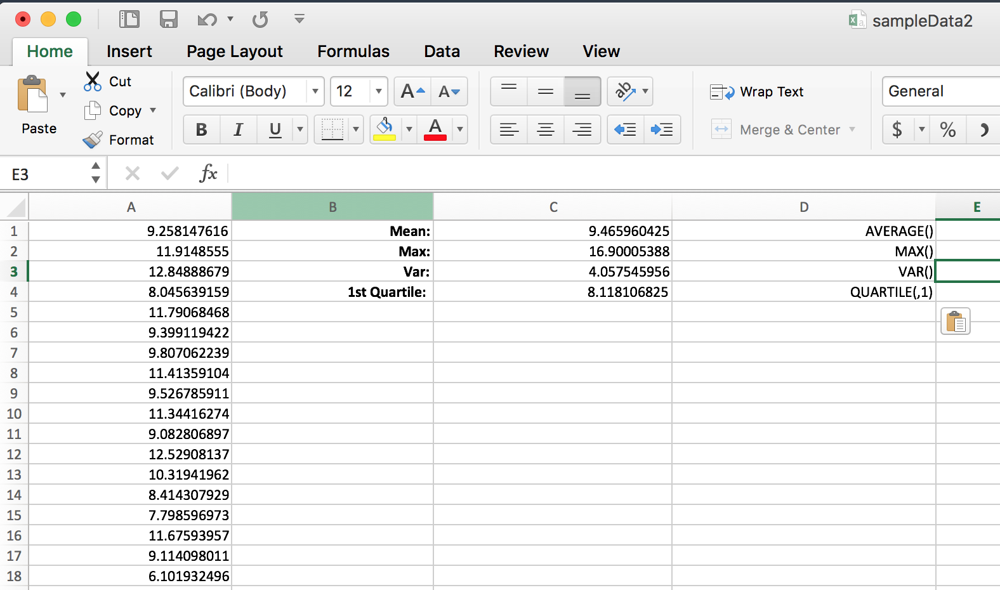

```{r setup, include=FALSE}
knitr::opts_chunk$set(echo = TRUE)
#include packages
library("plyr")
library("dplyr")
library("tidyr")
library("lattice")
library("ggplot2")
library("tibble")
library("gridExtra")
library("maps")
library("rgl")
library("rglwidget")

setwd("/Users/xinhuang/Google Drive/CSC 522 R Language Programming /Homework4")
```

```{r echo = TRUE, fig=TRUE, fig.align='center'}

```

#Answers to Question1 
##1a)
```{r echo = TRUE, fig=TRUE, fig.align='center'}
myData <- read.csv("HW01pb1data.csv", header = FALSE)
#exam all the columns
class(myData$V1)
class(myData$V2)
class(myData$V3)
class(myData$V4)
class(myData$V5)
```  
Given the resluts, we can see that column V1, V2, V3 are quantitative
V4 and V5 are qualitative.

##1b)
```{r echo = TRUE, fig=TRUE, fig.align='center'}
levels(myData$V4)
levels(myData$V5)
```
By printing out all the levels of column V4 and V5, we can see that they both contain data different data type. So when the data was read in, they can not be treated as numeric but as factors.

##1c)
```{r echo = TRUE, fig=TRUE, fig.align='center'}
mat <- matrix(1 : 2, nrow = 2)
layout(mat)
plot(myData[, 1], pch = 20, col = "blue",
     cex = 0.9, ylab = "V1",
     main = "Plot Column V1")
plot(myData[, 4], col = "red",
     main = "Plot Column V4")
```  
In the first pic, it plots column 1 scatters data on a x-y axis. It uses index and value as a x-y values
In the second pic, it plots column 4 as a histogram graph. It uses factors to count how many element are in each factors.

#Answers to Question2
##2a)
```{r echo = TRUE, fig=TRUE, fig.align='center'}
#Read original data and generate sample
myData <- read.csv("HW01pb2data.csv",header=FALSE)
sampleData <- sample(myData[, 1], 10000, replace=TRUE)
```  

##2b)
Compute those values using following functions:  
```{r echo = TRUE, fig=TRUE, fig.align='center'}
paste("Mean of sample data: ", mean(sampleData))
paste("Max of sample data: ", max(sampleData))
paste("Var of sample data: ", var(sampleData))
paste("Quantile of sample data: ", quantile(sampleData, 0.25))
```  

##2c)
Compute those values on original data:
```{r echo = TRUE, fig=TRUE, fig.align='center'}
paste("Mean of whole data: ", mean(myData[, 1]))
paste("Max of whole data: ", max(myData[, 1]))
paste("Var of whole data: ", var(myData[, 1]))
paste("Quantile of whole data: ", quantile(myData[, 1], 0.25))
```

##2d)
Write the data into a csv file:
```{r echo = TRUE, fig=TRUE, fig.align='center'}
write.csv(sampleData, file = "sampleData.csv", row.names= FALSE, col.names = FALSE)
```
Compute the values using Excel functions:  
  

#Answers to Question3  
##3a)  
```{r echo = TRUE, fig=TRUE, fig.align='center'}
ocean <- read.csv("HW01pb3OceanViewdata.csv", header = FALSE)
desert <- read.csv("HW01pb3Desertdata.csv", header = FALSE)

boxplot(ocean, at = 1, xlim = c(0.5, 2.5), 
        ylim = range(c(ocean, desert)), 
        main = "House Box Plots",
        ylab="Values",
        pch = 20,
        cex = 0.7,
        col ="blue") 
abline(h = median(ocean$V1), col = "lightblue", lty = 3)
text(1,  500, 
     paste("Median of Ocean ", median(ocean$V1)), 
     col = "blue", cex = 0.6)

boxplot(desert, at = 2, 
        add = TRUE, pch = 20,
        col ="red", cex = 0.7)
abline(h = median(desert$V1), col="red", lty = 3)
text(2,  1700, 
     paste("Median of Desert ", median(desert$V1)), 
     col = "red", cex = 0.6)
```  
  
From the graphs, we can find out that:
1. The average prices of ocean view houses is much higher than that of houses in the desert. Also median prices of ocean view hourse is much higher too.  

The data of ocean view whichc is houses is almost symmetrically distributed. On the other hand, the data of desert houses is more on one side  

##3b)  
```{r echo = TRUE, fig=TRUE, fig.align='center'}
names(ocean)[1] <- "HousePrice"
names(desert)[1] <- "HousePrice"
breaks <- seq.int(0, 3000, by = 250)
hist(ocean$HousePrice, breaks, main = "Ocenview House Distribution by Price",
     xlab = "Houce Price")
```  

##3c)  
```{r echo = TRUE, fig=TRUE, fig.align='center'}
par(mfrow=c(2,1))
plot(ecdf(ocean$HousePrice), 
     pch = 20 , cex = 0.5, col = "blue",
     main = "Empirical Cummulative Distribution Function of Ocenview Houses ")
legend("topleft", c("ocean"), col = c("blue"),
       pch = 20 ,inset =.1, title = "House price",
       cex = 0.8)

plot(ecdf(desert$HousePrice), 
     pch = 20 , cex = 0.5, col = "red",
     main = "Empirical Cummulative Distribution Function of Ocenview Houses ")
legend("bottomright", c("ocean"), col = c("red"),
       pch = 20 ,inset =.1, title = "House price",
       cex = 0.8)
```  

#Answers to Question4  
##4a)  
```{r echo = TRUE, fig=TRUE, fig.align='center'}
orange <- as.data.frame(Orange)
par(mfrow=c(1,1))
plot(orange$age, orange$circumference,
     main = "Orange Age by Circumference",
     xlim = c(min(orange$age),max(orange$age) + 100),
     ylim = c(min(orange$circumference),max(orange$circumference) + 100),
     xlab = "Orange Age",
     ylab = "Orange Circumference")
```  

##4b)
```{r echo = TRUE, fig=TRUE, fig.align='center'}
cor <- cor(orange[which(orange$Tree == 1), 2], orange[which(orange$Tree == 1), 3])
paste("Correlation between Age and Circumference is: ", cor)
```  

##4c)  
Use functions from ddply() to compute the resutls:  
```{r echo = TRUE, fig=TRUE, fig.align='center'}
names(orange) <- toupper(names(orange))
result <- orange %>% 
    group_by(TREE) %>% 
    summarise(COVARIANCE = cov(AGE, CIRCUMFERENCE), CORRELATION = cor(AGE, CIRCUMFERENCE))

result$TREE <- as.numeric(as.character(result$TREE))
result[order(result$TREE), ]
```  

##Answer to Question5  
##5a)
```{r echo = TRUE, fig=TRUE, fig.align='center'}
median(desert$HousePrice)
mean(desert$HousePrice)
```  

##5b)  
```{r}
hist(desert$HousePrice, breaks = 100)
abline(v = median(desert$HousePrice), col = "red")
abline(v = mean(desert$HousePrice), col = "blue")
```
I plotted the frequecy of the hourse price. The distribution is skewed to the right if there is a long tail to the right. That is if the mean is greater than the median, the distribution is skewed to the right. A few high numbers will pull the mean above the median. 

##5C)
```{r}
add10desert <- desert + 10
median(add10desert$HousePrice)
```
##5d)
```{r}
mult2desert <- desert * 2
median(mult2desert$HousePrice)
```


