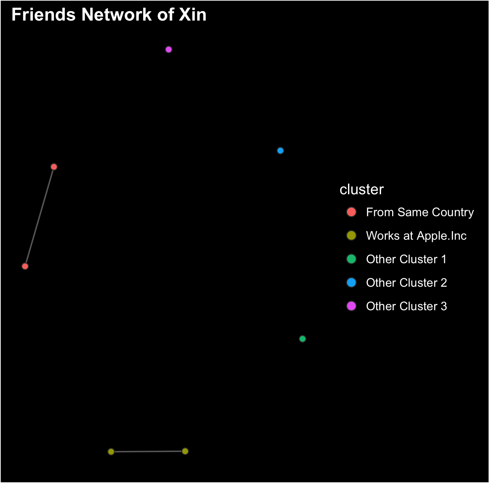
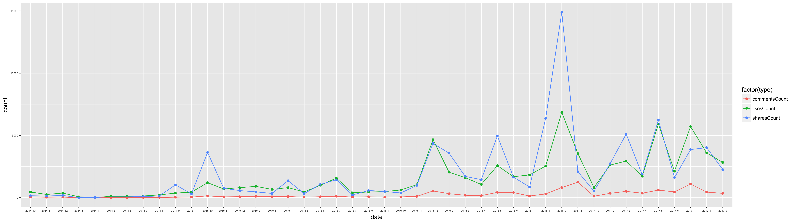
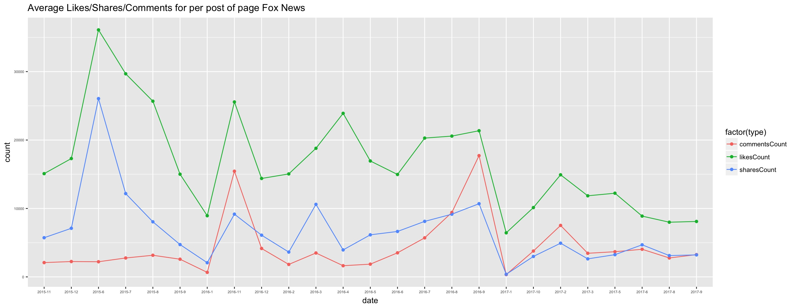
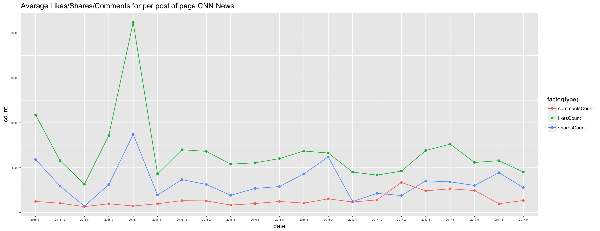
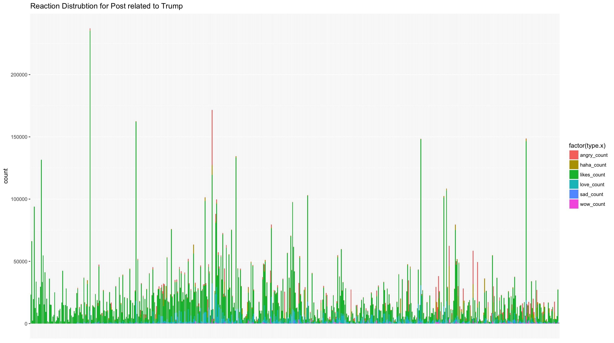
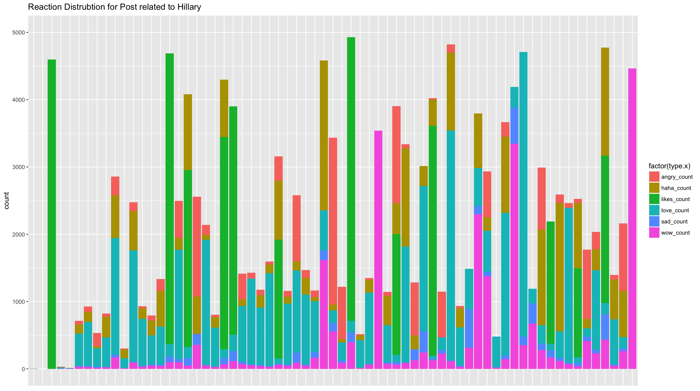
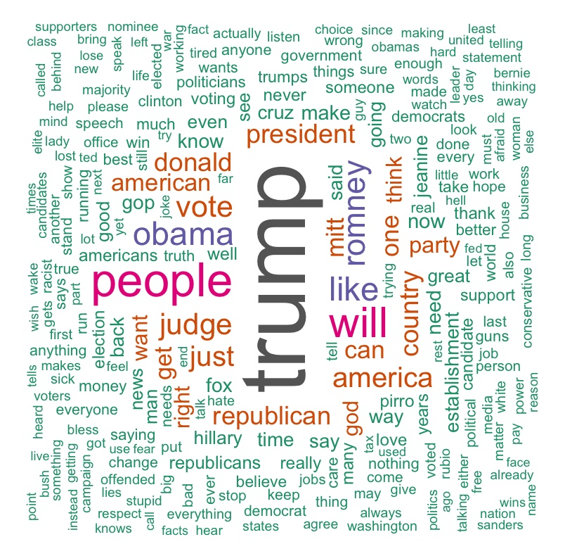
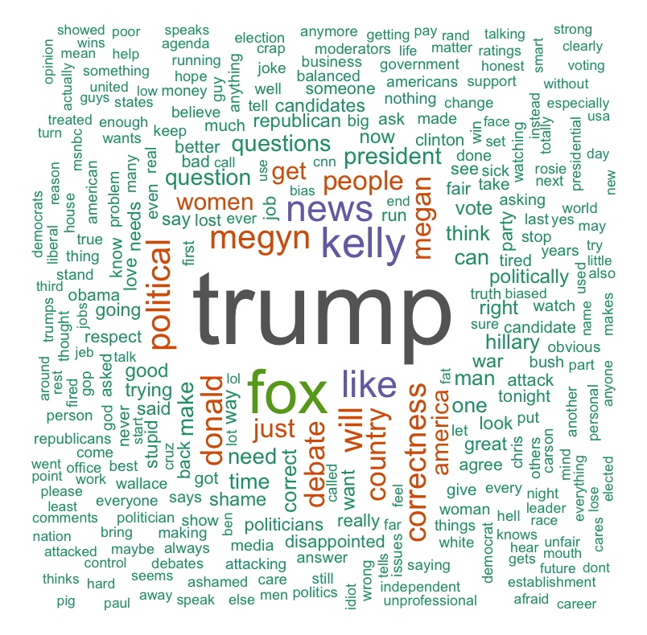

```{r echo=FALSE, results='hide', include=FALSE}
knitr::opts_chunk$set(echo = TRUE, fig.align="center")
urlBase <- "https://graph.facebook.com/"
apiVersion <- "v2.10"
setEnv <- function() {
    setwd("/Users/xinhuang/Google Drive/CSC 522 R Language Programming /Final Project/source")
    require(devtools)
    require (Rfacebook)
    require(rjson)
    require(tm)
    require(RCurl)
    require(wordcloud)
    require(igraph)
    require("scales")
    
    library(plyr)
    library(dplyr)
    library(tidyr)
    library(lattice)
    library(ggplot2)
    library(lubridate)
    library(rgl)
    library(rglwidget)
    library(wordcloud)
}
setEnv()

setConnector <- function(isToken, isOath = FALSE, isToCreateNewOath = FALSE) {
    appSetting <- fromJSON(file = "app_setting.json")
    if (isOath) {
        if (isToCreateNewOath) {
            fbOauth <- fbOAuth(app_id = appSetting$app_id, 
                               app_secret = appSetting$app_secret, 
                               extended_permissions = TRUE)
            save(fb_oauth, file = "fb_oauth")
            return(fbOauth)
        } else {
            return(fbOauth <- load("fb_oauth"))
        }
    } else {
        # Connect to Facebook API via Authentication Toke
        return(appSetting$token)
    }
}
fbToken <- setConnector(TRUE)
```


#Intro and Background
Social network websites have gained huge popularities in the past tens years. Websites like Facebook, Twitter,
Instagram and LinkedIn almost become a necessity in our daily lives, with the help mobile phones. Ordinaries
share their moments of lives, keep update from their friends, learn and share news all over the world from the
networks. Politicians share their polices and communicate with supports on the networks. Professionals share
their skills and experience or connect with each other on the networks. I will say those networks, that we built
together, are priceless assets of information and data. And by analyzing and digging the data (posts, pictures,
likes and sharing, surprising observation and deep buries trend can be found. The journals provided are simply
fantastic examples of data mining and analysis.
As a heavy user of all the websites mentioned above, I think it will be fun to dig out some interesting
information from my Facebook friends, posts or from some news pages and celebrities' account.  

#Problem Statement of Research
In this project, I am going to dig information from data retrieved from Facebook under the following aspects:  
1. Build network of my friends lists and cluter them into various gruops  
2. Analyze the popularity of several new pages and its relationship to the current plitical enviornment  
3. Analyze one most discuessed post from FOX News including the reactions and most used comment words  

# Main Packages Used for clustering, transforming data and text mining:  
1. __`Rfackbook`__: R package which works as a wrapper for calling Fackbook Open Restful APIs
2. __`igraph`__: Routines for simple graphs and network analysis. I uesed its APIs to clustering the data
3. __`tm`__: Text Mining Package in r. I used to build the wordcloud of comments  

#Anaylize network of My Friends
First Let us have a test of Facebook Friends API and see my friends that has enroll Facebook Devloper Account. Currently, the last version of APIs only retunes developer account. Here is code:  

```{r friendsList}
testFriendsAPIs <- function() {
    # get my own user information includ internal user id
    ownerInfo <- getUsers("me", fbToken, private_info=TRUE)
    # get user ID of my friends 
    friendsList <- getFriends(token = fbToken, simplify = FALSE)
    # acquire user information 
    friendsInfo <- getUsers(friendsList$id, fbToken, private_info = TRUE)
    # print out some columnbs of friendsInfo
    print.data.frame(friendsInfo[ , 2 : 7])
}
testFriendsAPIs()
```  
  
  
As we can see, only seven of my friends have enrolled as developers. But still we can try to investigate inner connection among them by clustering my friends into groups. __Here are the steps:__  
1. calling `getNetwork()` from `Rfacebook` package to retrieve my friends network as a graph  
2. using `fastgreedy.community()` from `igraph` to clustering the graph
3. using 'ggplot()' to visualize the results  
  
  
```{r eval = FALSE}
clusterFriendsNetworkData <- function() {
    friendsGraph <- getNetwork(fbToken, format = "adj.matrix")
    # preparing node list and layout with igraph
    network <- graph.adjacency(friendsGraph, mode="undirected") 
    # finc communities in graph
    fc <- fastgreedy.community(network)
    set.seed(123)
    
    # prepare data to plot 
    # determine the placement of the vertices for drawing a graph
    layoutCor <- layout.fruchterman.reingold(network, niter=1000, coolexp=0.5) 
    clusteredData <- data.frame(layoutCor) 
    names(clusteredData) <- c("x", "y")
    clusteredData$cluster <- factor(fc$membership)
    
    # add edges to the graph
    edgelist <- get.edgelist(network, names = FALSE)
    edges <- data.frame(clusteredData[edgelist[ , 1], c("x", "y")], 
                        clusteredData[edgelist[ , 2], c("x", "y")])
    names(edges) <- c("x1", "y1", "x2", "y2")
    
    clusteredData$degree <- degree(network)
    which.max(degree(network)) ## who do I have more friends in common with?
    central.nodes <- lapply(communities(fc), function(x) x[which.max(clusteredData$degree[x])])
    central.names <- fc$names[unlist(central.nodes)] ## names of central nodes
    
    ## labels I give to each cluster
    labels <- c("From Same Country", "Works at Apple.Inc", 
                "Other Cluster 1", "Other Cluster 2", "Other Cluster 3")
    clusteredData$label <- NA
    clusteredData$label[unlist(central.nodes)] <- labels
    
    return (clusteredData)
}

visualizeFriendsNetwork <- function() {
    clusteredData <- clusterFriendsNetworkData()
    
    p <- ggplot(clusteredData, aes(x = x, y = y, color = cluster)) + 
                    ggtitle("Friends Network of Xin")
    pq <- p + geom_segment(
        aes(x = x1, y = y1, xend = x2, yend = y2), 
        data = edges, size = 0.5, color = "white", alpha = 1/3) +
        geom_point(color = "grey20", aes(fill = cluster), shape = 21, size = 2) +
        scale_fill_discrete(labels = labels) +
        theme(
            plot.title = element_text(color = "white", face = "bold"),
            panel.background = element_rect(fill = "black"),
            plot.background = element_rect(fill="black"),
            axis.line = element_blank(), axis.text = element_blank(), 
            axis.ticks = element_blank(), 
            axis.title = element_blank(), panel.border = element_blank(), 
            panel.grid.major = element_blank(), 
            panel.grid.minor = element_blank(),
            legend.background = element_rect(colour = F, fill = "black"),
            legend.key = element_rect(fill = "black", colour = F),
            legend.title = element_text(color = "white"),
            legend.text = element_text(color = "white")) +
        guides(fill = guide_legend(override.aes = list(size=3)))
    
    # save plot
    ggsave(pq, file="1 FriendsNetwork.png")
}

visualizeFriendsNetwork()
```  
 
  
This is the final results I got:  
```{r echo=FALSE, out.width='60%'}

```  

Althought we are unable to plot more friends node due to Facebook restricting the inforamtoin you can get from their APIs, I am still able to cluster my seven valid freinds into five groups. 

#Analyze the popularity of several new pages
In the second section, I am going to explore the popularity of new pages on Fackook. I picked __Vox__ (a faily new media that founded in 2014), __CNN News__ (a more democratic new network) and __Fox News__ (a more republican new newwork).  

##Analyze Vox new media  
To achieve the goal, I requested lasteest 2000 news post from the news Facebook page. Then I aggrated the average liks/comments/shares for each posts. At the end, I plot the outcome in points and lines. Also I warppeed everything in one function and some util function so they can be reused laster.  

```{r eval = FALSE}
# Basic Analyze of Facebook Page: Vox
# convert Facebook date format to R date format
format.facebook.date <- function(datestring) {
    date <- as.POSIXct(datestring, format = "%Y-%m-%dT%H:%M:%S+0000", tz = "GMT")
}

# Ananlyze growth of selected new pages
visualizePageGrowth <- function(pageName = "vox", graphName) {
    page <- getPage(page = "FoxNews", token = fbToken, n = 2000, api = apiVersion)
    page$datatime <- format.facebook.date(page$created_time)
    page$month <- month(page$datatime)
    page$year <- year(page$datatime)
    
    # aggreate like/comments/shares grouped by years and month
    pageAggr <- page %>% 
        group_by(month, year) %>% 
           summarise(likesCount = mean(likes_count), commentsCount = mean(comments_count), sharesCount = mean(shares_count))
    pageAggr$date <- paste(pageAggr$year, '-', pageAggr$month, sep = "")
    
    pageAggr <- pageAggr %>% 
        gather("type", "count", - month, - year, -date)
    
    # plot the outcome
    p <- ggplot(pageAggr, 
                aes(date, count, group = type, colour = factor(type))) +
        ggtitle(graphName) + 
        geom_point() + 
        geom_line() + 
        theme(axis.text=element_text(size=5))
    p
    ggsave(plot = last_plot(), graphName, width = 20, limitsize = FALSE)
}

# VOX
visualizePageGrowth(pageName = "vox", graphName = "2 Average Replies for per post of page VOX")
```  

After calling function `visualizePageGrowth()`, the graph is created:  

```{r echo=FALSE, out.width='110%'}

```  

In general, we can say this news media is getting more popluar. And we can also notice that the peak happed in `2016-08` and `2016-9` when US Presidential Election was going close.  

##Analyze and Compare Fox News and CNN news 
By calling the same functions created above, I am able to draw the next two pics:  

```{r eval=FALSE, out.width='110%'}
#Fox News
visualizePageGrowth(pageName = "FoxNews", graphName = "3 Average Replies for per post of page Fox News")
# CNN News
visualizePageGrowth(pageName = "cnn", graphName = "4 Average Replies for per post of page CNN News")
```  

And here are the graphs:  

```{r echo=FALSE, out.width='110%'}


```  

Overall, News on FOX News pages are discussed bu users more, and Fox News is tend to be more republican.

#Analyze one most discuessed post from FOX News
In this section, I picked posts which either contains keywod "Trump" or "Hillary" and calculated averay count of each reactions (likes, love, haha, wow, sad, and angray) for each post. I expect to see people's perference on these two presicent candidates.  

##Analyze Reaction Distrbution of Trump and Hillary Related Post  
In this code, I first retrieved all posts from Fox News which contains "Trump" and "Hillary" as keywords. Then I required reacations for each post.  

```{r eval=FALSE}
anaylzeMostRepliedPost <- function() {
    # get most discussed post of among the last 2000 post from Fox News
    page <- getPage("FoxNews", fbToken, n = 2000)
    page <- page[order(page$likes_count), ]
    
    # post about Trump
    pageTrump <- page[grep("Trump", page$message), ]
    reactionsTrump <- getReactions(pageTrump$id, token = fbToken, api = apiVersion)
    
    # post abot Hillary 
    pageHillary <- page[grep("Hillary", page$message), ]
    reactionsHillary <- getReactions(pageTrump$id, token = fbToken, api = apiVersion)

    # plot the reactions for Trump
    pageAggrTrump <- reactionsTrump %>% 
        gather("type", "count", -id)
    # add the datetime information 
    pageAggrTrump <- merge(x = pageAggrTrump, y = pageTrump, by = "id", all.x = TRUE)
    
    p <- ggplot(pageAggrTrump, 
                aes(created_time, count, group = type.x, fill = factor(type.x))) +
        ggtitle("Reaction Distrubtion for Post related to Trump") + 
        geom_bar(stat="identity") +
        theme(axis.title.x=element_blank(),
              axis.text.x=element_blank(),
              axis.ticks.x=element_blank())
    p
    
    # plot the reactions for Hillary
    pageAggrHillary <- reactionsHillary %>% 
        gather("type", "count", -id)
    # add the datetime information 
    pageAggrHillary <- merge(x = pageAggrHillary, y = pageHillary, by = "id", all.x = TRUE)
    p <- ggplot(pageAggrHillary, 
                aes(created_time, count, group = type.x, fill = factor(type.x))) +
        ggtitle("Reaction Distrubtion for Post related to Hillary") + 
        geom_bar(stat="identity") +
        scale_y_continuous(limits = c(0, 5000)) +
        theme(axis.title.x=element_blank(),
              axis.text.x=element_blank(),
              axis.ticks.x=element_blank())
    p
    
    # Text Minining for the comments from Trump
    # Extract all the comment messages from most replaied post
    postTrump <- pageTrump[which(pageTrump$likes_count == max(pageTrump$likes_count)), ]
    postTrump <- getPost(post = postTrump$id, n = 3000, token = fbToken)
    postMessage <- (postTrump$comments)$message
    textMiningUtil(postMessage)
    
    postHillary <- pageHillary[which(pageHillary$likes_count == max(pageHillary$likes_count)), ]
    postHillary <- getPost(post = postHillary$id, n = 3000, token = fbToken)
    postMessage <- (postHillary$comments)$message
    textMiningUtil(postMessage)
}

textMiningUtil <- function(postMessage) {
    docs <- Corpus(VectorSource(postMessage))
    toSpace <- content_transformer(function (x, pattern) gsub(pattern, " ", x))
    docs <- tm_map(docs, toSpace, "/")
    docs <- tm_map(docs, toSpace, "@")
    docs <- tm_map(docs, toSpace, "\\|")
    
    # convert the text to lower case
    docs <- tm_map(docs, function(x) iconv(x, to='UTF-8-MAC', sub='byte'))
    docs <- tm_map(docs, content_transformer(tolower))
    # remove numbers 
    docs <- tm_map(docs, removeNumbers)
    # remove English common stop words
    docs <- tm_map(docs, removeWords, stopwords("english"))
    # remove punctuatios 
    docs <- tm_map(docs, removePunctuation)
    # remove extra white space 
    docs <- tm_map(docs, stripWhitespace)
    
    dtm <- TermDocumentMatrix(docs)
    m <- as.matrix(dtm)
    v <- sort(rowSums(m), decreasing = TRUE)
    d <- data.frame(word = names(v), freq = v)
    head(d, 20)
    
    p <- wordcloud(words = d$word, freq = d$freq, min.freq = 1, 
                   max.words = 300, random.order = FALSE, 
                   rot.per = 0.35, colors = brewer.pal(8, "Dark2"))
    p
}
```  

Here are the results:  
```{r echo=FALSE, out.width='110%'}


```  

As we can see, Trump did get more likes from news related to him. This is consistent with the result of elections.   

## Build Word Cloud from the most discussed News Post related to Trump
In this section, I picked the most discussed news post and acquired list of comments for that post. I built a text mining util function above to help to cleasen and prepare the messages and uesed `wordcloud` to build the graph. 

Here are the results:  
```{r echo=FALSE, out.width='50%'}


```  

Word cloud graph give us a very direct view of what are more concered by the people left the comments.

#Conclusion and ideas for future work
Overall, I explored some basic use case for text mining from the data from social network. Give the size of the data, some hidden information can be reviled if we cleasen and transform our data correctly. However, due to the restricatio of Facebook API, I am not able to retirve more data from the website which limit my exploration. If given more time and resource, I hope to imporve the plot of my friends network.

#Reference
ANALYTICS PRACTICE : FACEBOOK TEXT ANALYSIS (Jinsuh, L) retrieved from http://web.ics.purdue.edu/~jinsuh/analyticspractice-facebook.php  

Rfacebook: Access to Facebook API via R retrieved from https://github.com/pablobarbera/Rfacebook

# Source Code
```{r eval = FALSE}
urlBase <- "https://graph.facebook.com/"
apiVersion <- "v2.10"

installRequiredPackages <- function() {
    install.packages("devtools")
    install_github("Rfacebook", "pablobarbera", subdir="Rfacebook")
    install.packages("tm")
    install.packages("RCurl")
    install.packages("wordcloud")
    install.packages("igraph")
    install.packages("lubridate")
    install.packages("grep")
}

setEnv <- function() {
    setwd("/Users/xinhuang/Google Drive/CSC 522 R Language Programming /Final Project/source")
    require(devtools)
    require (Rfacebook)
    require(rjson)
    require(tm)
    require(RCurl)
    require(wordcloud)
    require(igraph)
    require("scales")
    
    library(plyr)
    library(dplyr)
    library(tidyr)
    library(lattice)
    library(ggplot2)
    library(lubridate)
    library(grep)
    library(rgl)
    library(rglwidget)
    library(wordcloud)
}

writeResponsToFile <- function(data, fileName) {
    cat(toJSON(data), file = paste(fileName, "json", sep = "."))
}

setConnector <- function(isToken, isOath = FALSE, isToCreateNewOath = FALSE) {
    appSetting <- fromJSON(file = "app_setting.json")
    if (isOath) {
        if (isToCreateNewOath) {
            fbOauth <- fbOAuth(app_id = appSetting$app_id, 
                               app_secret = appSetting$app_secret, 
                               extended_permissions = TRUE)
            save(fb_oauth, file = "fb_oauth")
            return(fbOauth)
        } else {
            return(fbOauth <- load("fb_oauth"))
        }
    } else {
        # Connect to Facebook API via Authentication Toke
        return(appSetting$token)
    }
}

setEnv()
fbToken <- setConnector(TRUE)

# Get personal data
path <- "me?fields=birthday,name,age_range,gender,languages,hometown,email,relationship_status"
response <- callAPI(paste(urlBase, path, sep=""), fbToken, api = "v2.10")


# get list of friends of selected user Xin
testFriendsAPIs <- function() {
    ownerInfo <- getUsers("me", fbToken, private_info=TRUE)
    friendsList <- getFriends(token = fbToken, simplify = FALSE)
    friendsList
    friendsInfo <- getUsers(friendsList$id, fbToken, private_info = TRUE)
    friendsInfo
}
testFriendsAPIs()

clusterFriendsNetworkData <- function() {
    friendsGraph <- getNetwork(fbToken, format = "adj.matrix")
    # preparing node list and layout with igraph
    network <- graph.adjacency(friendsGraph, mode="undirected") 
    # finc communities in graph
    fc <- fastgreedy.community(network)
    set.seed(123)
    
    # prepare data to plot 
    # determine the placement of the vertices for drawing a graph
    layoutCor <- layout.fruchterman.reingold(network, niter=1000, coolexp=0.5) 
    clusteredData <- data.frame(layoutCor) 
    names(clusteredData) <- c("x", "y")
    clusteredData$cluster <- factor(fc$membership)
    
    # add edges to the graph
    edgelist <- get.edgelist(network, names = FALSE)
    edges <- data.frame(clusteredData[edgelist[ , 1], c("x", "y")], clusteredData[edgelist[ , 2], c("x", "y")])
    names(edges) <- c("x1", "y1", "x2", "y2")
    
    clusteredData$degree <- degree(network)
    which.max(degree(network)) ## who do I have more friends in common with?
    central.nodes <- lapply(communities(fc), function(x) x[which.max(clusteredData$degree[x])])
    central.names <- fc$names[unlist(central.nodes)] ## names of central nodes
    
    ## labels I give to each cluster
    labels <- c("From Same Country", "Works at Apple.Inc", "Other Cluster 1", "Other Cluster 2", "Other Cluster 3")
    clusteredData$label <- NA
    clusteredData$label[unlist(central.nodes)] <- labels
    
    return (clusteredData)
}

visualizeFriendsNetwork <- function() {
    clusteredData <- clusterFriendsNetworkData()
    
    p <- ggplot(clusteredData, aes(x = x, y = y, color = cluster)) + 
                    ggtitle("Friends Network of Xin")
    pq <- p + geom_segment(
        aes(x = x1, y = y1, xend = x2, yend = y2), 
        data = edges, size = 0.5, color = "white", alpha = 1/3) +
        geom_point(color = "grey20", aes(fill = cluster), shape = 21, size = 2) +
        scale_fill_discrete(labels = labels) +
        theme(
            plot.title = element_text(color = "white", face = "bold"),
            panel.background = element_rect(fill = "black"),
            plot.background = element_rect(fill="black"),
            axis.line = element_blank(), axis.text = element_blank(), 
            axis.ticks = element_blank(), 
            axis.title = element_blank(), panel.border = element_blank(), 
            panel.grid.major = element_blank(), 
            panel.grid.minor = element_blank(),
            legend.background = element_rect(colour = F, fill = "black"),
            legend.key = element_rect(fill = "black", colour = F),
            legend.title = element_text(color = "white"),
            legend.text = element_text(color = "white")) +
        guides(fill = guide_legend(override.aes = list(size=3)))
    
    # save plot
    ggsave(pq, file="1 FriendsNetwork.png")
}

visualizeFriendsNetwork()


# Basic Analyze of Facebook Page: Vox
# convert Facebook date format to R date format
format.facebook.date <- function(datestring) {
    date <- as.POSIXct(datestring, format = "%Y-%m-%dT%H:%M:%S+0000", tz = "GMT")
}

# Ananlyze growth of selected new pages
visualizePageGrowth <- function(pageName = "vox", graphName) {
    page <- getPage(page = "FoxNews", token = fbToken, n = 2000, api = apiVersion)
    page$datatime <- format.facebook.date(page$created_time)
    page$month <- month(page$datatime)
    page$year <- year(page$datatime)
    
    # aggreate like/comments/shares grouped by years and month
    pageAggr <- page %>% 
        group_by(month, year) %>% 
           summarise(likesCount = mean(likes_count), commentsCount = mean(comments_count), sharesCount = mean(shares_count))
    pageAggr$date <- paste(pageAggr$year, '-', pageAggr$month, sep = "")
    
    pageAggr <- pageAggr %>% 
        gather("type", "count", - month, - year, -date)
    
    # plot the outcome
    p <- ggplot(pageAggr, 
                aes(date, count, group = type, colour = factor(type))) +
        ggtitle(graphName) + 
        geom_point() + 
        geom_line() + 
        theme(axis.text=element_text(size=5))
    p
    ggsave(plot = last_plot(), graphName, width = 20, limitsize = FALSE)
}

# VOX
visualizePageGrowth(pageName = "vox", graphName = "2 Average Replies for per post of page VOX")
#Fox News
visualizePageGrowth(pageName = "FoxNews", graphName = "3 Average Replies for per post of page Fox News")
# CNN News
visualizePageGrowth(pageName = "cnn", graphName = "4 Average Replies for per post of page CNN News")

# Anyalze the responce fo certain post
# Still take FOX News news page as target 
anaylzeMostRepliedPost <- function() {
    # get most discussed post of among the last 2000 post from Fox News
    page <- getPage("FoxNews", fbToken, n = 2000)
    page <- page[order(page$likes_count), ]
    
    # post about Trump
    pageTrump <- page[grep("Trump", page$message), ]
    reactionsTrump <- getReactions(pageTrump$id, token = fbToken, api = apiVersion)
    
    # post abot Hillary 
    pageHillary <- page[grep("Hillary", page$message), ]
    reactionsHillary <- getReactions(pageTrump$id, token = fbToken, api = apiVersion)

    # plot the reactions for Trump
    pageAggrTrump <- reactionsTrump %>% 
        gather("type", "count", -id)
    # add the datetime information 
    pageAggrTrump <- merge(x = pageAggrTrump, y = pageTrump, by = "id", all.x = TRUE)
    
    p <- ggplot(pageAggrTrump, 
                aes(created_time, count, group = type.x, fill = factor(type.x))) +
        ggtitle("Reaction Distrubtion for Post related to Trump") + 
        geom_bar(stat="identity") +
        theme(axis.title.x=element_blank(),
              axis.text.x=element_blank(),
              axis.ticks.x=element_blank())
    p
    
    # plot the reactions for Hillary
    pageAggrHillary <- reactionsHillary %>% 
        gather("type", "count", -id)
    # add the datetime information 
    pageAggrHillary <- merge(x = pageAggrHillary, y = pageHillary, by = "id", all.x = TRUE)
    p <- ggplot(pageAggrHillary, 
                aes(created_time, count, group = type.x, fill = factor(type.x))) +
        ggtitle("Reaction Distrubtion for Post related to Hillary") + 
        geom_bar(stat="identity") +
        scale_y_continuous(limits = c(0, 5000)) +
        theme(axis.title.x=element_blank(),
              axis.text.x=element_blank(),
              axis.ticks.x=element_blank())
    p
    
    # Text Minining for the comments from Trump
    # Extract all the comment messages from most replaied post
    postTrump <- pageTrump[which(pageTrump$likes_count == max(pageTrump$likes_count)), ]
    postTrump <- getPost(post = postTrump$id, n = 3000, token = fbToken)
    postMessage <- (postTrump$comments)$message
    textMiningUtil(postMessage)
    
    postHillary <- pageHillary[which(pageHillary$likes_count == max(pageHillary$likes_count)), ]
    postHillary <- getPost(post = postHillary$id, n = 3000, token = fbToken)
    postMessage <- (postHillary$comments)$message
    textMiningUtil(postMessage)
}

textMiningUtil <- function(postMessage) {
    docs <- Corpus(VectorSource(postMessage))
    toSpace <- content_transformer(function (x, pattern) gsub(pattern, " ", x))
    docs <- tm_map(docs, toSpace, "/")
    docs <- tm_map(docs, toSpace, "@")
    docs <- tm_map(docs, toSpace, "\\|")
    
    # convert the text to lower case
    docs <- tm_map(docs, function(x) iconv(x, to='UTF-8-MAC', sub='byte'))
    docs <- tm_map(docs, content_transformer(tolower))
    # remove numbers 
    docs <- tm_map(docs, removeNumbers)
    # remove English common stop words
    docs <- tm_map(docs, removeWords, stopwords("english"))
    # remove punctuatios 
    docs <- tm_map(docs, removePunctuation)
    # remove extra white space 
    docs <- tm_map(docs, stripWhitespace)
    
    dtm <- TermDocumentMatrix(docs)
    m <- as.matrix(dtm)
    v <- sort(rowSums(m), decreasing = TRUE)
    d <- data.frame(word = names(v), freq = v)
    head(d, 20)
    
    p <- wordcloud(words = d$word, freq = d$freq, min.freq = 1, 
                   max.words = 300, random.order = FALSE, 
                   rot.per = 0.35, colors = brewer.pal(8, "Dark2"))
    p
}
```

